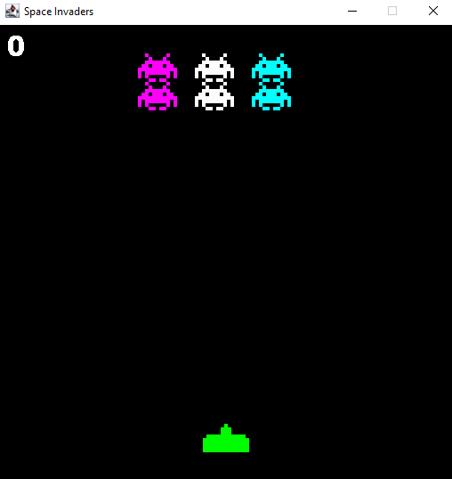
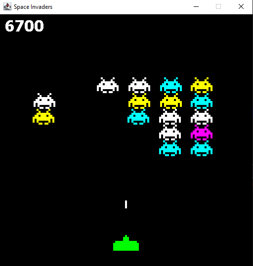
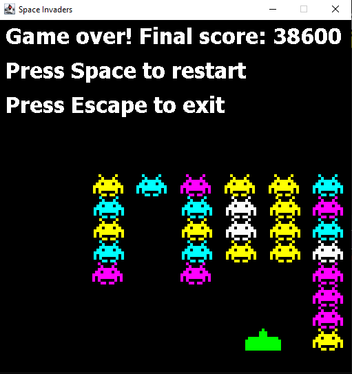

# Space Invaders

Made a game of Space Invaders using Java.

## How to Play

- Eliminate the aliens!
- The aliens appear in waves that grow larger over time
- Each alien you eliminate gives you 100 points 
- Each wave you clear gives you 500 points.
- Don't let the aliens reach your ship.
- There is no limit, kill as many aliens as you can!

## Requirements to Play
- Java JDK 8 or higher
- Any Java IDE or terminal that is can run Java 

## Controls
- **Left Arrow** moves your ship to the left
- **Right Arrow** moves your ship to the right
- **Space** shoots bullets at the aliens *and* restarts the game once you lose
- **Esc** exits the game (You may exit the game at any time).

## Game features:
- Increasing difficulty with each wave
- Randomized alien appearances
- Collision detection system
- Score tracking
- Game over + restart system

## IDE Used:
IntelliJ

## Made by:
Isaac Afram

## Screenshots:

